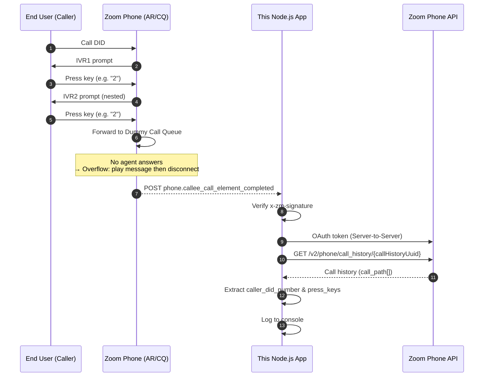
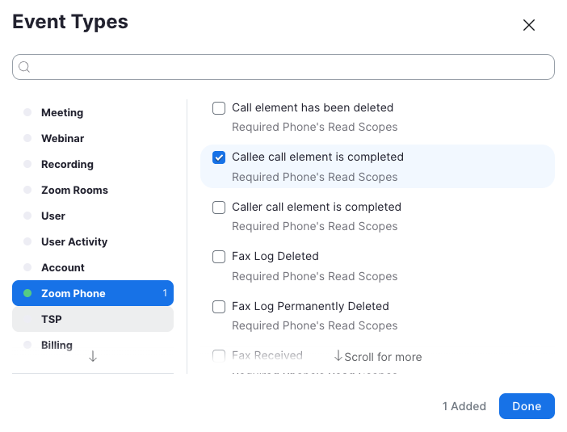
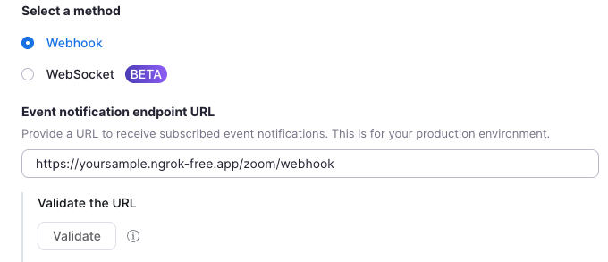
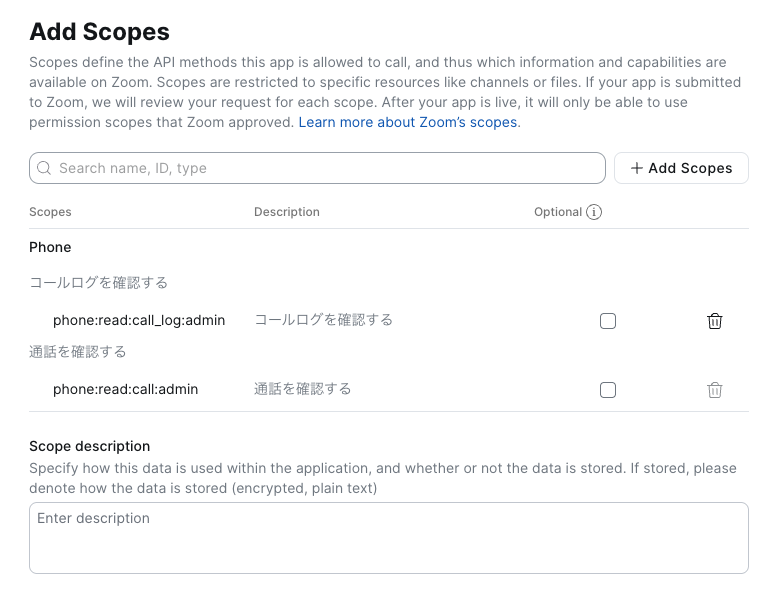
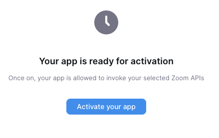
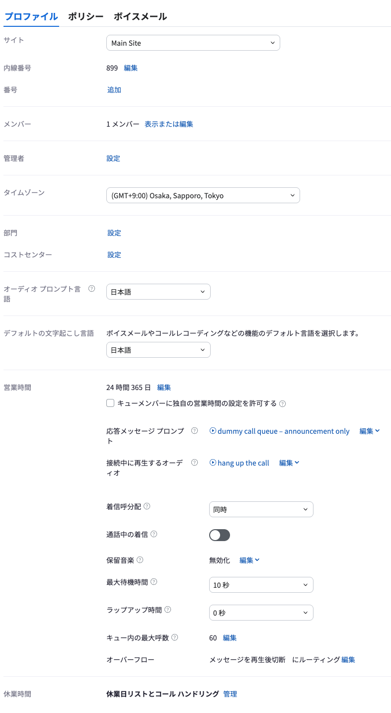

# Zoom Phone AR(IVR) Webhook 受信 PoC ガイド

> ⚠️ The following sample application is a personal, open-source project shared by the app creator and not an officially supported Zoom Communications, Inc. sample application. Zoom Communications, Inc., its employees and affiliates are not responsible for the use and maintenance of this application. Please use this sample application for inspiration, exploration and experimentation at your own risk and enjoyment. You may reach out to the app creator and broader Zoom Developer community on <https://devforum.zoom.us/> for technical discussion and assistance, but understand there is no service level agreement support for this application. Thank you and happy coding!

> ⚠️ このサンプルのアプリケーションは、Zoom Communications, Inc.の公式にサポートされているものではなく、アプリ作成者が個人的に公開しているオープンソースプロジェクトです。Zoom Communications, Inc.とその従業員、および関連会社は、本アプリケーションの使用や保守について責任を負いません。このサンプルアプリケーションは、あくまでもインスピレーション、探求、実験のためのものとして、ご自身の責任と楽しみの範囲でご活用ください。技術的な議論やサポートが必要な場合は、アプリ作成者やZoom開発者コミュニティ（ <https://devforum.zoom.us/> ）にご連絡いただけますが、このアプリケーションにはサービスレベル契約に基づくサポートがないことをご理解ください。

## 1. 背景と目的

Zoom Phone の **Auto Receptionist (AR) = IVR** は、
**AR がコールを保持している間は Webhook が発火しない** という仕様上の制約がある。

そのため「IVR でエンドユーザーが押した番号 (press\_key) をリアルタイムに Webhook で受け取りたい」という要件はそのままでは実現できない。

本 PoC では、この制約を回避するために **「ダミーエージェントしかいないダミー Call Queue へ Forward してコールを AR の外へ出す」** 構成を採用し、
`phone.callee_call_element_completed` Webhook を発火させたうえで、Call History API を引いて必要な情報 (発信元電話番号・各 IVR で押下された番号) を取り出す。

**Webhook が飛ばないパターン(AR 内で完結)**

AR(IVR)の中だけでコールが終わる構成。press\_key の情報を取得したくても、そもそも Webhook が発火しないためアプリ側には何も届かない。


**Webhook が飛ばせるパターン(Dummy CQ 経由)**

最終ノードを Dummy Call Queue に Forward し、そこで Overflow 切断することで AR の外側で通話が終わる。これにより `phone.callee_call_element_completed` が発火し、`call_history_uuid` が取得できる。


***

## 2. 全体フロー



補足:

* AR の最終ノードに **「Forward to Call Queue (Dummy CQ)」** を置く。

* Dummy CQ には応答しないダミーエージェントのみを所属させ、Overflow Action を `Play a message then disconnect` に設定。

* こうすることで AR の外 (CQ) で通話が終わるため、`phone.callee_call_element_completed` が発火する。

***

## 3. Webhook ペイロード (受信側) の要点

Zoom から届く Webhook の本体 (モック例):

```json
{
  "event": "phone.callee_call_element_completed",
  "event_ts": 1700000000000,
  "payload": {
    "account_id": "mock-account-id",
    "object": {
      "user_id": "mock-user-id",
      "call_elements": [
        {
          "call_history_uuid": "20260101-xxxxxxxx-xxxx-xxxx-xxxx-xxxxxxxxxxxx",
          "call_id": "1234567890",
          "caller_did_number": "+81500000000",
          "callee_ext_number": "000",
          "operator_ext_type": "call_queue",
          "operator_name": "dummy call queue",
          "direction": "inbound",
          "result": "no_answer"
        }
      ]
    }
  }
}
```

ここから使うのは **`call_history_uuid`** のみ。残りの情報 (caller\_did\_number / press\_key) は次ステップで API 経由で取得する。

> このサンプル実装ではペイロード内の `caller_did_number` を直接使わず、**API のレスポンス側の値** を正として採用している。
> 理由: Webhook ペイロードは「ある 1 つの call element」に関する情報のみが含まれており、全 IVR ノードの press\_key を拾うには結局 API を叩く必要があるため。

***

## 4. Call History API レスポンスから欲しい情報を取り出す

### エンドポイント

```
GET https://api.zoom.us/v2/phone/call_history/{callHistoryUuid}
Authorization: Bearer {access_token}
```

必要スコープ (Server-to-Server OAuth):

* `phone:read:call_history:admin`

### レスポンス(モック・抜粋)

```json
{
  "call_history_uuid": "20260101-xxxxxxxx-xxxx-xxxx-xxxx-xxxxxxxxxxxx",
  "direction": "inbound",
  "caller_did_number": "+81500000000",
  "callee_name": "Top-Level AR",
  "call_path": [
    {
      "is_node": 1,
      "event": "incoming",
      "operator_name": "IVR1",
      "callee_ext_type": "auto_receptionist"
    },
    {
      "is_node": 0,
      "operator_name": "IVR1",
      "operator_ext_type": "auto_receptionist",
      "press_key": "2"
    },
    {
      "is_node": 1,
      "event": "forward",
      "operator_name": "IVR1",
      "callee_name": "IVR2"
    },
    {
      "is_node": 0,
      "operator_name": "IVR2",
      "operator_ext_type": "auto_receptionist",
      "press_key": "2"
    },
    {
      "is_node": 1,
      "event": "forward",
      "operator_name": "IVR2",
      "callee_name": "dummy call queue",
      "callee_ext_type": "call_queue",
      "result": "overflowed",
      "result_reason": "play_a_message_then_disconnect"
    }
  ]
}
```

### ルール

| 取り出したいもの      | 取り出し方                                                                                            |
| ------------- | ------------------------------------------------------------------------------------------------ |
| 発信元の電話番号      | トップレベルの `caller_did_number`                                                                      |
| 各 IVR で押された番号 | `call_path[]` を走査し、`is_node === 0` かつ `press_key` を持つ要素を抽出。`operator_name` と `press_key` をペアでログ化 |

上のモック例なら、

```
caller_did_number : +81500000000
pressed key [1]   : 2  @ IVR1
pressed key [2]   : 2  @ IVR2
```

が得られる。IVR を多段にしている場合はその段数分だけ `is_node: 0` + `press_key` の要素が並ぶ。

> 参考: `call_elements[]` にも同じ情報が含まれるが、時系列のたどりやすさの観点で本 PoC では `call_path[]` を使用している。

***

## 5. セットアップ

### 5.1. Zoom Marketplace アプリ

**Server-to-Server OAuth アプリ** を 1 つ作成する。Marketplace でのアプリ作成手順そのものの詳細は [2025年版 はじめての Zoom API - Server to Server OAuth編](https://qiita.com/michitakasugi/items/c9ba4d37c6441bffd2c9) および [2026年版 はじめての Zoom Webhook](https://qiita.com/michitakasugi/items/d000291f1b8d5a51e71c) 参照。以下の順で設定する:

1. **Information** — アプリ名・会社情報・Developer Contact など、必須項目を入力する。

2. **Feature > Token** — `Secret Token` を控え、`.env` の `ZOOM_WEBHOOK_SECRET_TOKEN` に設定する。( Secret Token を `.env` に設定完了後、 `ngrok http 3000` を実行しエンドポイントURLを控え `npm start` を実行する )

3. **Feature > General Features > Event Subscriptions** を ON にする。

   * Event Notification Endpoint URL: `{ngrokUrl}/zoom/webhook` を入力する

   * Event types: `Phone > Callee's Call Element Completed` (`phone.callee_call_element_completed`) を追加
   
   

   * URL を保存したら **Validate** で検証が通ることを確認する。
   
   

4. **Scopes** — `Add Scopes` から以下を追加する(「phone:read:call:admin 通話を確認する」はWebhookのEvent Type追加により自動的に追加されている):

   * `phone:read:call_log:admin`

     

5. **App Credentials** — `Account ID` / `Client ID` / `Client Secret` を控えて `.env` に設定する。

6. **Activation** — 最後に必ず **Activate your app** を押してアプリを有効化する。これを忘れると OAuth トークン取得も Webhook 受信もできないので要注意。



### 5.2. Zoom Phone 側の構成

AR → (各 IVR ノード) → 最終ノードで **Dummy Call Queue へ Forward** する構成。以下の順で作成する。

#### (1) Dummy Agent(ダミーユーザー)の用意

* 新規ユーザー(または既存の未使用ユーザー)を 1 名用意する。

* **Zoom Phone Pro ライセンス** を割り当てる(Call Queue メンバーとして必須)。

* 外線番号(DID)の割り当ては**不要**。内線のみで OK。

* Webhook 発火条件として **Call Queue での着信鳴動** が必須なので、Dummy Agent は**着信を受けられる状態**にしておく。

  * 実際にZoom Phoneでサインインしておく必要はない（不出でOK）。

  * ただし **休日・営業時間設定が Call Queue 側に反映されないように**、24時間365日着信できる状態であることをユーザー単位でも確認する。

  * 転送や DND を設定すると着信自体が走らず Overflow に入らない可能性があるため、これらはオフにしておく。

#### (2) Dummy Call Queue の作成

* Call Queue を新規作成し、メンバーに上で用意した **Dummy Agent のみ** を追加する。

* その他の設定(推奨値):

| 項目            | 設定値                                                                 |
| ------------- | ------------------------------------------------------------------- |
| 営業時間          | **24 時間 365 日**(AR 側の営業時間制御をそのまま通したいため、CQ 側では制限しない)                 |
| 応答メッセージプロンプト  | 例: 「お問い合わせいただいたお電話番号宛に、申込手順を SMS で送信いたしました。お電話をお切りいただき、内容をご確認ください。」 |
| 接続中に再生するオーディオ | 例: 「ご利用ありがとうございました。お電話をお切りください。」(繰り返し)                              |
| 着信呼分配         | 同時                                                                  |
| 通話中の着信        | オフ                                                                  |
| 保留音楽          | 無効化                                                                 |
| 最大待機時間        | 10 秒程度                                                              |
| ラップアップ時間      | 0 秒                                                                 |
| キュー内の最大呼数     | 60(デフォルト)                                                           |
| オーバーフロー       | **メッセージを再生後に切断にルーティング**。メッセージ内容は上記「ご利用ありがとうございました。お電話をお切りください。」など   |

> 各メッセージは **Text to Speech (TTS)** で作成して問題ない。ポイントは、Dummy Agent は実際には応答しないので、**「最大待機時間 → オーバーフロー」の流れを必ず通る** ように組むこと。これにより `phone.callee_call_element_completed` が安定して発火する。

#### (3) AR(IVR)側の設定

* AR のメニュー設計はそのままで、最終的な転送先を **上で作成した Dummy Call Queue** に向ける。

* IVR が多段の場合でも、末端で必ず Dummy CQ に Forward するようにしておくことで、press\_key の履歴が `call_path[]` に全て残る。

#### (4) 設定参考画像



### 5.3. 環境変数

`.env.example` をコピーして `.env` を作成:

```
PORT=3000
ZOOM_WEBHOOK_SECRET_TOKEN=...
ZOOM_ACCOUNT_ID=...
ZOOM_CLIENT_ID=...
ZOOM_CLIENT_SECRET=...
```

### 5.4. 起動

```bash
npm install
npm start
```

### 5.5. ngrok でローカルを公開 (PoC)

別ターミナルで:

```bash
ngrok http 3000
```

`https://xxxxx.ngrok-free.app/zoom/webhook` を Marketplace の Event Subscription の URL に登録し、Validate を実行する。

***

## 6. コード解説 (`server.js`)

主要関数の役割:

| 関数                            | 役割                                                                                                                    |
| ----------------------------- | --------------------------------------------------------------------------------------------------------------------- |
| `getAccessToken()`            | Server-to-Server OAuth で `/oauth/token` を叩き、アクセストークンを取得してメモリキャッシュ。                                                    |
| `fetchCallHistory(uuid)`      | `GET /v2/phone/call_history/{uuid}` を実行しレスポンスを返す。                                                                     |
| `verifyZoomSignature(req)`    | `x-zm-signature` を `v0:ts:rawBody` の HMAC-SHA256 で検証する。                                                               |
| `extractPressedKeys(history)` | `call_path[]` から `is_node: 0` かつ `press_key` ありの要素を抽出。                                                                |
| `POST /zoom/webhook` ハンドラ     | URL validation / 通常イベントを分岐処理し、`phone.callee_call_element_completed` だけ実処理。`200 OK` を先に返してから API 呼び出し (Zoom 側のリトライ回避)。 |

設計上のポイント:

* **raw body を保持** : 署名検証には元のバイト列が必要なので、`express.json({ verify })` で `req.rawBody` を生成してから JSON パースしている。

* **ACK 先行** : Zoom Webhook は 3 秒以内に 2xx を返さないとリトライが走る可能性があるため、重い処理 (OAuth + API) はレスポンス送信後に非同期で行う。

* **トークンキャッシュ** : S2S OAuth のトークンは通常 1 時間有効。都度取りに行くと無駄なので 60 秒マージンで使い回す。

***

## 7. 動作確認

1. `npm start` でアプリを起動
2. 別ターミナルで `ngrok http 3000`
3. Marketplace のエンドポイント URL を更新し、**Validate** ボタンで検証 → 200 で通ることを確認
4. DID に実機から発信し、IVR1 / IVR2 をそれぞれ操作 (例: 2 → 2) してからそのまま放置 (Dummy CQ で自動切断)
5. アプリ側のコンソールに以下のように出れば成功:

```
[info] Webhook received. call_history_uuid=20260101-xxxxxxxx-xxxx-xxxx-xxxx-xxxxxxxxxxxx
--------------------------------------------------
caller_did_number : +81500000000
pressed key [1]   : 2  @ IVR1 (ext 001)
pressed key [2]   : 2  @ IVR2 (ext 002)
--------------------------------------------------
```

***

## 8. Next step: Lambda への連携

`server.js` の TODO コメント部分 (Webhook ハンドラ内) に、Lambda エンドポイント (API Gateway 等) へ POST する処理を追加するだけ。ペイロード例:

```json
{
  "callerDidNumber": "+81500000000",
  "pressedKeys": [
    { "operator_name": "IVR1", "press_key": "2" },
    { "operator_name": "IVR2", "press_key": "2" }
  ]
}
```

受け側 Lambda は既存のとおり、電話番号と press\_key から対象テキストを決定し、SMS 送信する。

***

## 9. 既知の制約 / 注意点

* **AR 内で完結する IVR では Webhook が発火しない** のが大前提。必ず Dummy CQ 経由にする。

* Dummy CQ の Overflow Timeout を短くしすぎると音声ガイダンスが流しきれずに切れる可能性がある。ガイダンス長 + 数秒の余裕をみて設定すること。

* `call_history` API はコール終了後にレコードが生成される。Webhook のタイミングとほぼ同時だが、まれに API が 404 を返すケースがある (PoC では未ハンドル)。本番化する場合はリトライ(指数バックオフ)を入れることを推奨。

* press\_key を押さずに IVR をタイムアウトさせた場合、その IVR ノードの `call_path` 要素には `press_key` が入らない。抽出ロジックは該当段を自動的にスキップする。
